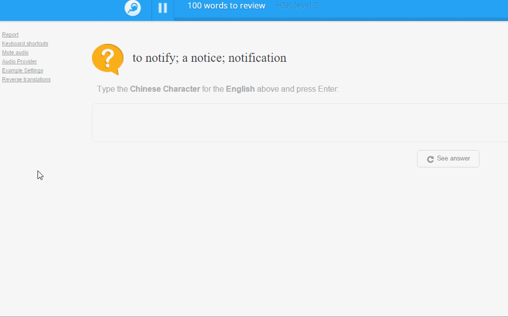

# Memrise Reverse Translations

Userscript which can be used to reverse the testing direction of Memrise tests. 

### Installation

The easiest method is through the Tampermonkey [chrome extension](https://chrome.google.com/webstore/detail/dhdgffkkebhmkfjojejmpbldmpobfkfo) / [firefox addon](https://addons.mozilla.org/firefox/addon/tampermonkey/).

Then add the script using the following link: https://github.com/cooljingle/memrise-reverse-translations/raw/master/Memrise_Reverse_Translations.user.js

### Usage
Click the relevant link on the side to toggle reverse translations for the current course you are in. The changes are applied for that course's future tests.
